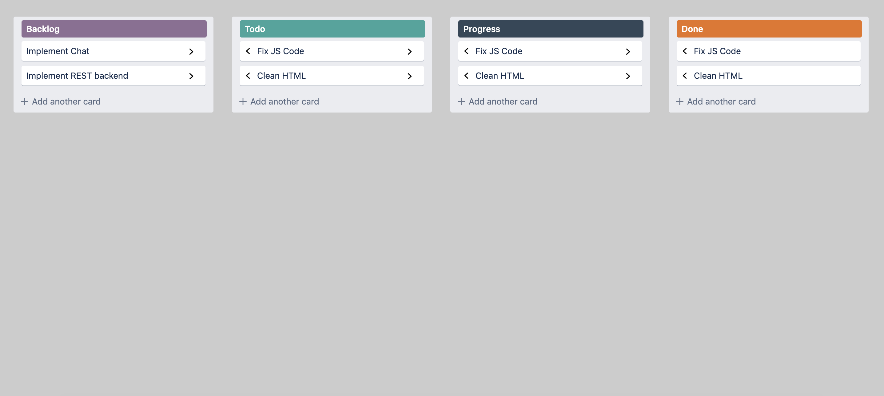

# It was 2 rounds interview: live video
    1 Coding: building shopping cart(React);
    2 Techincal interview (system design, restAPI etc);
        and below are question from Technical interview:

* Requirements
1) Layout
2) Style
3) Add card functionality with window.prompt
4) Move cards to other columns
5) Store data in client side so when you refresh you can see 

1 Promise?

2 What is the javascript's concurrency model look like under the hood?(about asynchronous JS)

3 Data binding( 2 way data binding vs 1 way data binding)? pros and cons?

4 Immutable objects? and what are the trade offs using immutable objects?

### CSS
1 When your browser loads a web page it has to turn CSS rules into styles on an element and what is the rule of match given element? how does the browser determine how to style those elements? 

2 What is the differences between margin and padding?

3 Many CSS frameworks has a rule assigning box-sizing to border-box, what does this mean to you?

4 Responsive design? using percentages vs pixels?

5 If UX designers gave us 200 small icons to use in our website, what is efficient way to distrubute those assets in our website? and what if i'm using instead of icons but something like different way to describe icons?

### rest API

1 GET vs POST requests? POST vs PATCH requests?

2  If i'm uploading data to a server, how do I tell what type of data to expect? and where do I set that?

3 Browsers commonly cache HTTP requests, how do browsers determine what to cache and for how long?

4 Where do i set the ETag?

5 What is the cookie?How secure cookie?

6 HTTP2 vs HTTP? 

7 How does your browser establish a secure connection with your server using HTTPS?

8 How does the browser know that is talking with trusted server using HTTPS?

9 Cross Site Script Attack (XSS)? how to prevent that happening?

10 Cross Site Request Forgery (CSRF)? how to prevent that happening?

11 How should we store passwords in the database? 

## Algorithms & Data structures

1 HashMap? how it is implemented?

2 Binary Search Tree?

3  Balanced Binary Tree?

4 How can you make sure your Binary Search Tree stays balanced as you add items?

5 Do you know any Data structures that do balancing automatically?

6 How would you find case smallest element in Binary Search Tree? What is the run time on that?

### System design

It scrapes car websites like craigslist and cars.com and downloads the informations on used cars.
Scraper attends you with list of key value pairs like: make, model, price, location, color, mileage.
And co-worker gives you 10gb file of car data(json) no duplicates and tells you here is your job to build us web app and which lets user to search over this data. 
    Your options of course  structed queries like: what are the red habits of a car that has less than 50K mileage for sale in LA and return all the cars that match this.

`Web Scraper` (how would you build the Front End and the Back End )

And the rest listen guys, because many technical subjects are involved such as how is you API going to look like and etc..
