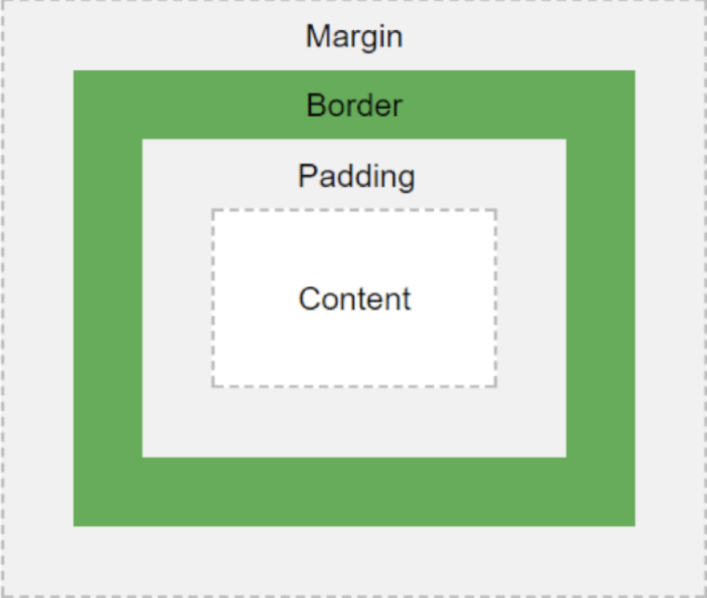
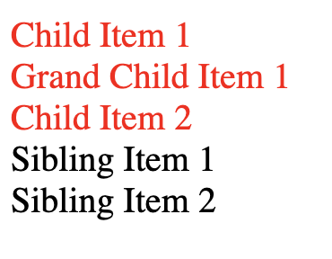
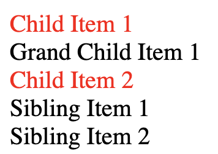
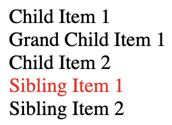

Phone Screen Interview for person {name}

Overall: Not inclined for HTML/CSS. 
The candidate was able to answer definitions questions but struggled on 
 HTML/CSS practise questions. 
 
Q) Explain the three main ways to apply CSS styles to a web page?

Follow up questions: Ask them to implement all 3 ways. 
* inline
* internal
* external

* Dueon
Made mistake on ,
```<div style="color:black,font-size:12px"```

* Nadia:

```fontSize```

* Omurbek

```<p font-size="16px" color="red">P```


Q) What are the differences of pseudo elements and pseudo classes?
Ask them to give samples on coding.

* Pseudo Element
```p::first-line { ... }```
* Pseudo Classes
```.link:hover { ... }```


Q) Can you tell about CSS preprocessors? Advantages of preprocessors?

Q) Can you tell about CSS Sprites? Advantages of CSS Sprites?

Q) What do you know about flexbox? What can you show?

```
  // Code
```

Q) What is CSS Box Model? 


Q) Can you tell me HTML 5 elements?

```
  // Answer
```

Q) What is Semantic HTML? Samples?

```
  // Answer
```

Q) What is Responsive WEB?

Give this code and ask following questions
```
  <div>Content</div>
  div { background-color: red }
```
* On iPad change bg color to blue
```
 // Code
```
Answer
```
@media screen and (max-width: 768px) {
  div { background-color: blue }
}
```

* On mobile devices change bg color to purple
```
 // Code
```
Answer
```
@media screen and (max-width: 767px) {
  div { background-color: purple }
}
```


Q) Do you know CSS Box Sizing?

Give this code and ask following questions:
```
<div>1</div>
<div>2</div>
body { margin:0; padding: 0 }
```

Using only CSS

 1) Set all divs height to 50px;
 2) Set all divs width to 50%;
 3) Add border 5px, solid, black
 4) First Bg color blue, second div bg color red
 5) Divs should be horizontal(this will not work)
 6) How do you fix it?
 
 Answer
 https://jsfiddle.net/marattig/yaLv417m/35/


Q) How do you target something inside or around another element?

Then give this code and ask following questions.
```
<div class="nav">
  <div class="nav-item">Child Item 1</div>
  <div><div class="nav-item">Grand Child Item 1</div></div>
  <div class="nav-item">Child Item 2</div>
</div>
<div class="nav-item">Sibling Item 1</div>
<div class="nav-item">Sibling Item 2</div>
```

* Change color of all .nav-item inside .nav?



Candidate's Answer:
```
 // Code
```

Right Answer:
```
.nav .nav-item { color: red }
```

* Change color of only child items(.nav-item) inside .nav, not grandChildren?



Candidate's Answer:
```
 // Code
```

Right Answer:
```
.nav  > .nav-item { color: red }
```

* Change color of only next sibling item(Sibling Item 1)?



Candidate's Answer:
```
 // Code
```

Right Answer:
```
.nav + .nav-item { color: red }
```


* Change color of all sibling items of nav?


Candidate's Answer:
```
 // Code
```

Right Answer:
```
.nav ~ .nav-item { color: red }
```

Q) Can you tell CSS Display Properties? What are the differences? How can you hide an element?

Give this url https://codepen.io/marattig/pen/mdbaQqR and ask following questions.

note:  display inline - you cannot apply height and width

1) Make boxes horizontally
2) What is the difference between inline/inline-block/block;
3) Change display to "inline".
4) Apply height/width to divs.
5) Remove second element from the view
6) Hide first element from the view


Q) Can you tell me CSS Positions? What are the differences?

```static; absolute; relative; fixed```

Give this code ```https://codepen.io/marattig/pen/RwbvjZr``` and ask to change to this: ```https://codepen.io/marattig/pen/gOYqXGL```


Q) What is the CSS Specificity?

Give this code ```https://codepen.io/marattig/pen/pozGdBx``` and ask to change to this: ```https://codepen.io/marattig/pen/ExYrbrq```

Q) What is Z-index in CSS?
Give this code ```https://codepen.io/marattig/pen/OJLdOZm``` and ask to change to this: ```https://codepen.io/marattig/pen/aboXVYr```
